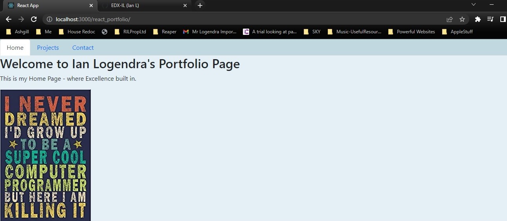

React Portfolio

## Table of contents

- [Overview](#overview)
  - [The challenge](#the-challenge)
  - [Screenshot](#screenshot)
  - [Links](#links)
- [My process](#my-process)
  - [Built with](#built-with)
  - [What I learned](#what-i-learned)
  - [Continued development](#continued-development)
  - [Useful resources](#useful-resources)
- [Author](#author)
- [Acknowledgments](#acknowledgments)


## Overview

Using React.js to create a portfolio website

### The challenge

For this challenge, I will utilize what I have learned in `Module 13: React` to develop the initial scaffolding of my portfolio site.


### Screenshot




### Links

- Solution URL: [https://github.com/EDX-IL/react_portfolio](https://github.com/EDX-IL/react_portfolio)
- Live Site URL: [https://edx-il.github.io/react_portfolio/](https://edx-il.github.io/react_portfolio/)

## My process

I began by creating my local react environment. I then created a basic react-dom site with headings. This worked on my local machine. I then tested the deployment. This actually ate up most of my time on the project as i had no success deploying the app for 2 days. Even though it was working locally i couldn't get it to successfully deploy. I tried both my Mac and PC. Both Dane's method in his video, and the readme from GH-Pages. I even spent a good bit of time with a tutor from ASKBCS. Basically nothing worked. So i was about to give up and take the L. But i tried doing it the usual way i would do thing. I created the repo on github then cloned it down. Then created the react app within that. I also used the default react app/build to test it was working. And it did! So i them slowly added my components from my other attempts (note there won't be the number of commits i normally would have as those repos were deleted over the 6 or 7 attempts to get things working). This has however left me with little time to implement my projects page. I basically want to do a list of projects on the left of the screen below the header and then when click on the screen shot and link to the project appears on the right. Nothing too difficult or clever. But it's now an hour before the next class and so i'm going to submit this as is. And then update if and when i get a chance. 

### Built with

- React.js
- CSS custom properties
- Javascript


### What I learned

- To be patient
- Ask for help
- Not to give up
- Go back to first principles if all else fails
- How to implement CSS in JSX
- How to import images to be used on the webpage

To see how you can add code snippets, see below:

```js
const styles = {
  projects : {
    width:"100%",
    height:"100%",
    background: "#e4f0f5"
  },

}

<div style={styles.projects}>
```

```js
import avatar from "../images/cool-prog.jpg"
```


### Continued development

- I would work on the overall style/theme of the site
- Project page/tab needs worked 
- Layout of the pages to be improved eg home page centered image better fonts, contacts page with a form and nicer links fonts. 


### Useful resources

- [CSS color picker ](https://www.w3schools.com/colors/colors_picker.asp) - This helped because VSCode didn't provide the usual colours in the coding window. 
- [How to use CSS in React](https://css-tricks.com/different-ways-to-write-css-in-react/) - This article helped with the syntax for using CSS within the react js pages.
- [ReactJS Documentation](https://reactjs.org/docs/getting-started.html) - Excellent reference guide for all things React. 


## Author
  Ian Logendra
- GitHub - [https://github.com/EDX-IL](https://github.com/EDX-IL)

## Acknowledgments

Dane, Andrew, Beau, Noah, Johnathan (TA's) - for all their support and expertise.
